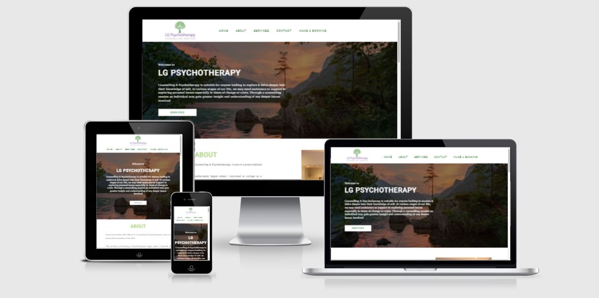
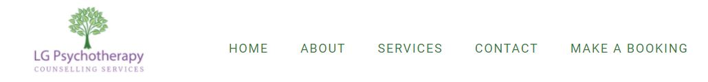
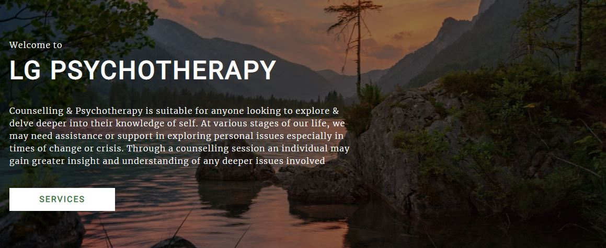
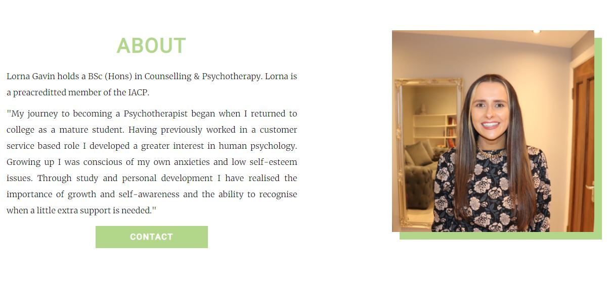
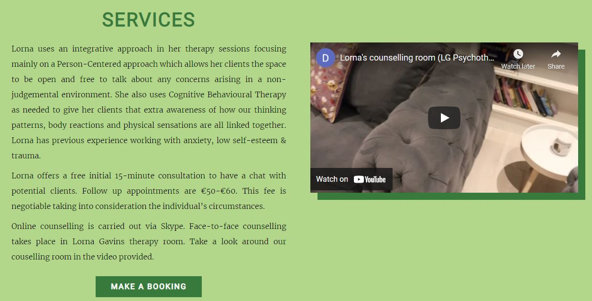
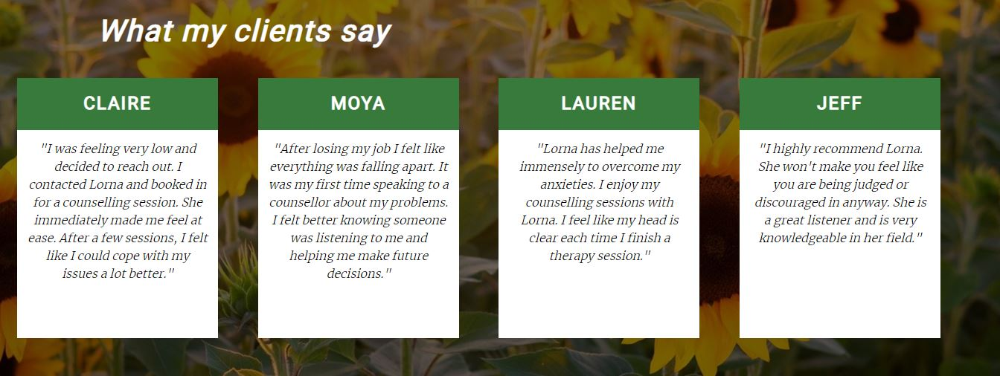
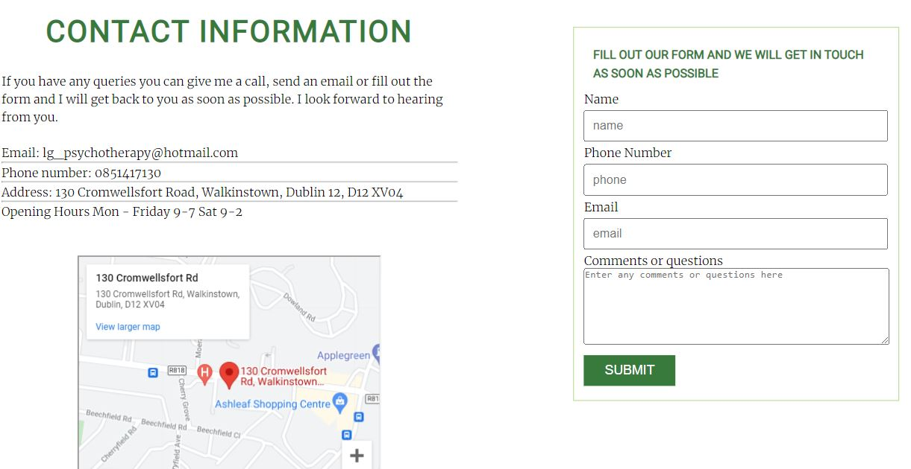
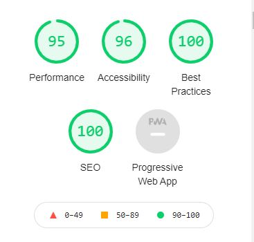

<h1 align="center"> LG Psychotherapy </h1>

LG Psychotherapy is a counselling website aimed at adults who are looking for an online/face-to-face counsellor. 
Any user of this site will be able to find out information about the services offered at LG Psychotherapy. They will also find information about the counsellor Lorna Gavin who owns LG Psychotherapy

<h2 align="center"> Features </h1>

### Header/Navigation

- The sites header is located at the top of the website page. 
- The navigation links are nested inside the header
- To the left, we can see the LG Psychotherapy logo which links to the home page.
- To the right, we can see the fully responsive navigation links (Home, About, Services, Contact and Make  a booking)
- Home, About, Services and Contact all link to different sections of the main index page.
- Make a booking is located on a separate page as it contains a large form for the user to fill out.
- The LG Psychotherapy logo contains three colours (green, lighter green and purple.
- The navigation links are the same colour green that we see in the logo.
- The hover colour is the same as the light green in the logo.
- These colours are used throughout the website to maintain visual consistency

### Hero Image

- This section is located directly underneath the header.
- The hero image chosen for this site shows a lake landscape with mountains and trees.
- This image was picked as it is a calming, peaceful background image.
- On the left-hand side of the image we can see the cover text which shows the main heading and a paragraph explaining what counselling is and who can benefit from it.

### About Section

- The about section informs users about the counsellor Lorna Gavin and why she became a counsellor.
- This section is important as it allows Lorna Gavin to introduce herself to potential clients.
- This section is valuable to users as they get to know a bit more about about the counsellor Lorna Gavin.
- The about section also includes an image of the counsellor Lorna Gavin and a button linking to the services section.
- The image of Lorna Gavin allows users to put a face to their potential counsellor.

### Services Section

- This section allows users to find out about the type of Psychotherapy/ Counselling that Lorna Gavin provides to her clients.
- This section also allows users to take a look at the counselling room via YouTube video.
- This section is important to users as they will get a better understanding about the couselling services provided at LG Psychotherapy and if they would like to go for face-face counselling or online counselling.
- Users will know by this stage if they would like to go for online or face-to-face counselling.
- There is a button in this section linking to the Make a Booking page.

### Testimonial Section

- There is no link to this section as it is not as prominent as the other sections on the website.
- This section contains testimonials from Lorna’s previous and current clients.
- This section is valuable to users as they can find out what other people thought of LG Psychotherapy.

### Contact Section

- The contact section provides the user with the address, contact number, email and Google map for LG Psychotherapy
- There is a small contact form in this section that the user can fill out quickly if they have any queries.
- This section is valuable to the user as they can quickly find out all the contact information about LG Psychotherapy and get in touch ASAP via contact form.

### Footer

- The footer section includes social media icons (Facebook, Twitter and Instagram).
- These icons were downloaded from the Font Awesome Website.
- When clicked these icons bring the user to the social media platforms on a separate page.
- These icons are useful to the user as they are also a means of contact.

### Make a Booking Page

- This page allows users to book a counselling session with the counsellor Lorna Gavin.
- The form on this page gathers the users contact information.
- The form asks the users to provide the time and day that suits them and which counselling service they are interested in. 

### Features left to implement 

- A blog page that contains articles about Counselling and Psychotherapy.
- Links to additional resources for suicide prevention and depression.

<h2 align="center"> Design </h2>

### Colour Scheme

- The main colours used in this website are green, light green, purple and white.
- The colours were picked from the logo.
- The green and purple are contrasting colours that complement one another. 
- Green and purple were chosen for this website/logo as both colours can create a calming effect.

### Font

- The two fonts used in this website (Merriweather and Roboto) are part of the Google font library.
- Merriweather is a serif font. It was chosen as it is used in the LG Psychotherapy logo. 
- Roboto is a basic sans-serif font. This font was picked as it is a clean modern typeface which can be paired with most Google Fonts.

### Imagery

- The background images picked for this website are consistent with the logo. 
- The hero image is a lake landscape with trees and mountains. 
- The background image chosen for the make a booking page is a photo of trees with sun shining through.

<h2 align="center"> Testing </h2>

### W3c Validator

The website was tested using W3C Markup Validator and W3C CSS Validator. Any errors that were found throughout the process of creating this website were fixed. The final testing that was carried out on all pages out showed no errors.

### Other Testing 

The website was tested on different size screens using the website Responsinator(http://www.responsinator.com/?url=https%3A%2F%2Fdeecooper.github.io%2Flgpsychotherapy%2F) 
and Dev tools on Chrome. The website is responsive on all screen sizes.

Both forms on the website were tested several times. The main input fields require an entry before the user can submit the form. The email section only works if a user enters an email address.

I tested the website on Google Chrome, Mozilla Firefox and Internet Explorer.

The site was also tested by three people on different mobile devices and two desktops.

### Bugs

- The main bug that I had an issue with was the overflow-y: hidden property, which stopped my website from scrolling. I went through all of my code and realised it was the overflow-y property that was causing the problem.
- Another bug I encountered was the border: none value. I set the border none in my asterisk at the top of my CSS file. I soon realised it was causing the input fields on my form to have an entry field with no box border. I fixed this by removing the border property from the asterisk and adding the box border property to the input field in my CSS file.

### Known bugs

My website doesnt look the same on Internet Explorer. The colour scheme isnt working and the font looks different.

### Lighthouse

I ran a lighthouse audit on my website. The results of the audit are shown in the picture below

<h2 align="center"> Credits </h2>

### Content

- The images I used were downloaded off the Pixabay website 
(https://pixabay.com/)

- The video featured on the website was created by the developer

- The background music included in the video was downloaded from (https://www.bensound.com/)

- The image of Lorna Gavin, the counsellor was taken by the developer

- The logo on the website was purchased from the Logo Maker website
(https://www.logomaker.com/home-return)

- The social media icons in the footer were taken from a website called Font Awesome
(https://fontawesome.com/)

### Code

- The code for the social media links in the footer was taken from the love running website
https://github.com/Code-Institute-Solutions/love-running-2.0-sourcecode/commit/a78fffc1efdeca3f6fb96e9be27b0ebee484eba8

My mentor Antonio Rodriguez helped me with the header element as I couldn’t get my logo and navigation links to line up with one another. 

He helped me write out this code which he researched on w3 schools

#container-header {
    display: flex;
}

#logo-holder{
    width: 30%;
    text-align: center;
    display: inline-block;
}

#logo-holder img{
    width: 40%;
    margin: auto;
    padding: 10px;
}

#logo-holder a {
    display: block;
    position: relative;
}

#menu-holder{
    display: inline-block;
}

I had issues making my whole button clickable and not just the text. I found the information here (https://www.codecademy.com/forum_questions/536ccab4548c35ad24001a2e)
I used the display: block property which fixed my issue.

I wanted to put a box shadow behind my image and video. I found out how to do it using w3 schools. I used the code and changed the shadow colour and size.
(https://www.w3schools.com/cssref/tryit.asp?filename=trycss3_box-shadow)
I used the background-blend mode property which I researched from stack overflow. I used this property to make my overlay visible
(https://stackoverflow.com/questions/36679649/how-to-add-a-color-overlay-to-a-background-image/36679903)

### Further Testing

The website was tested on Google Chrome, Internet Explorer and Mozilla firefox. 
The website takes longer to load on internet explorer and the colour are distorted.
I got two friends to test the website on desktop and mobile devices.

<h2 align="center"> Deployment </h2> 

The site was deployed to Github pages and a live link to the website was provided. 
The deployment steps are as follows
1.	Log into git Hub
2.	Locate the specific repository
3.	Select the settings link
4.	In the settings scroll down to pages
5.	Under the source heading select the dropdown menu and select main.
6.	A link to your website will be provided 
7. https://deecooper.github.io/lgpsychotherapy/

